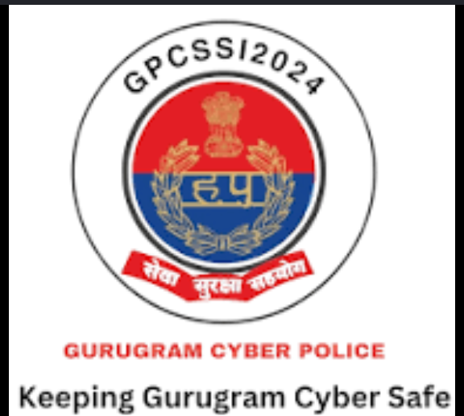
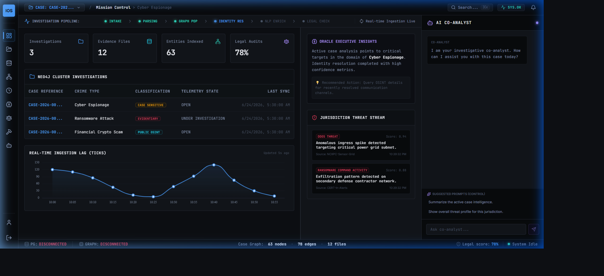
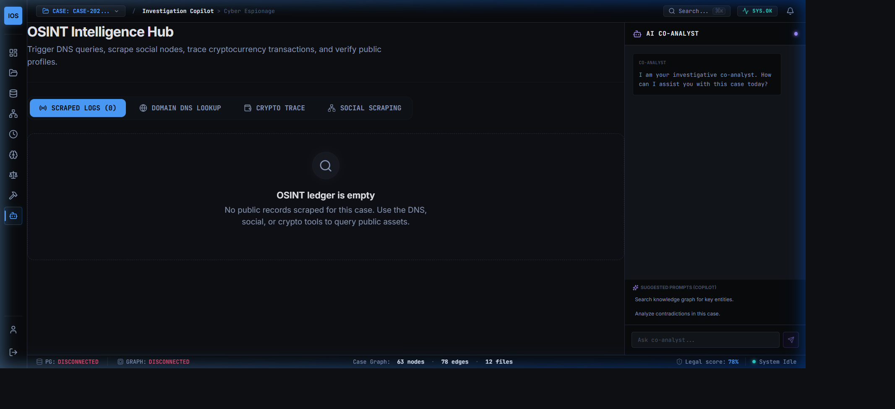
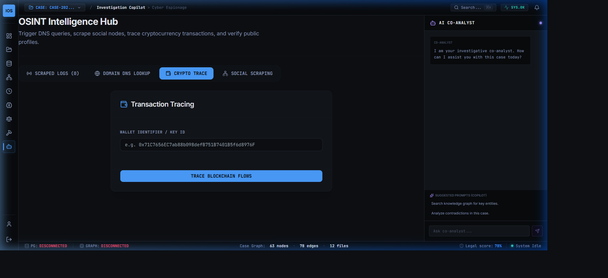
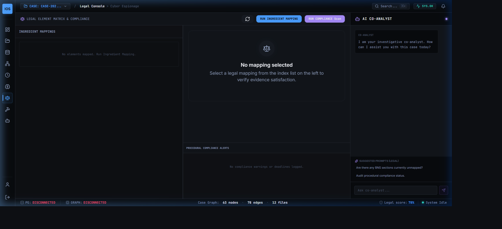
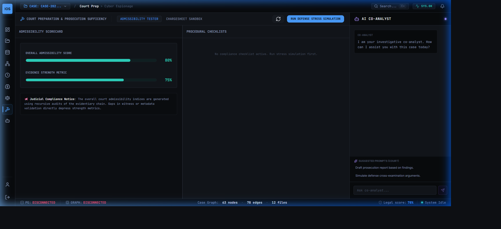
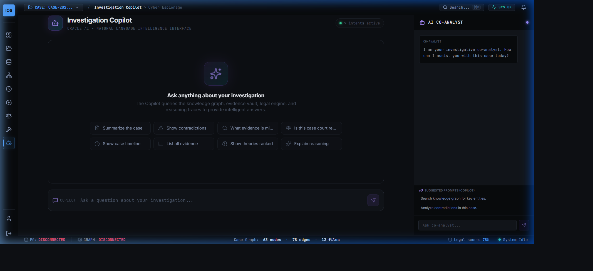
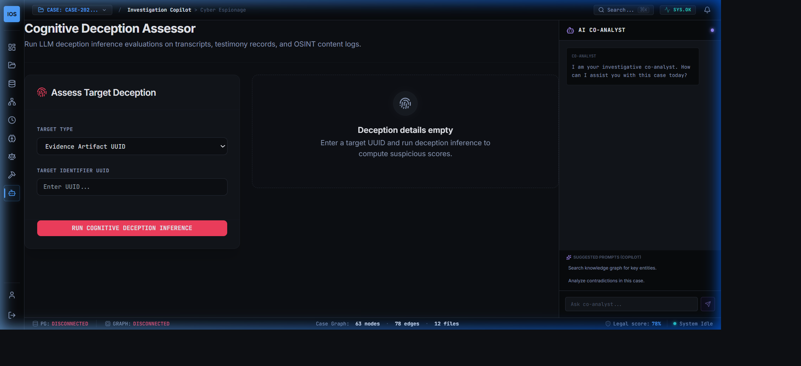
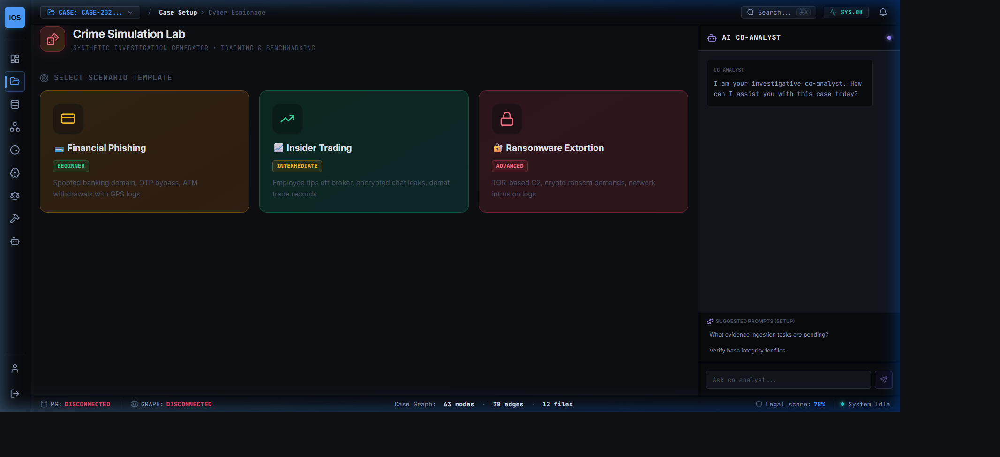
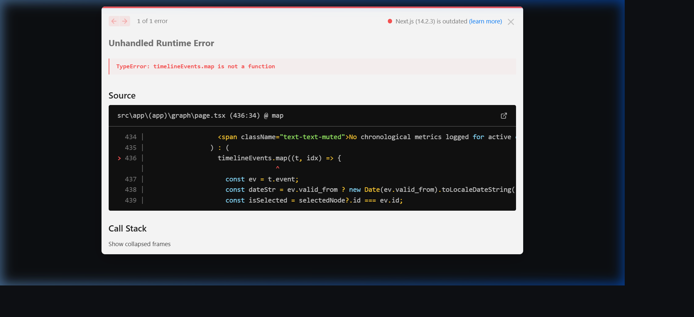

# Technical Guide: Crime Intelligence Platform
## Case Management, Knowledge Graph, OSINT, and BNSS/BSA Legal Analytics
### Project Report | GPCSSI 2024 Internship Program | Gurugram Cyber Police

<div align="center">
  
  <br/>
  <b>Gurugram Cyber Police — GPCSSI 2024</b>
  <br/>
  <i>Keeping Gurugram Cyber Safe</i>
  <br/>
  <b>Repository:</b> <a href="https://github.com/hunny0025/Crime-Intel-Platform">github.com/hunny0025/Crime-Intel-Platform</a>
</div>

---

## Table of Contents
1. [Executive Summary](#1-executive-summary)
2. [System Architecture](#2-system-architecture)
3. [Forensic Logic & Probabilistic Engine](#3-forensic-logic--probabilistic-engine)
4. [HPL Hypothesis Predicate Grammar](#4-hpl-hypothesis-predicate-grammar)
5. [Legal Subsystem: BNSS 2023 / BSA 2023](#5-legal-subsystem-bnss-2023--bsa-2023)
6. [Interactive User Interface Library](#6-interactive-user-interface-library)
7. [Filing Readiness Classification](#7-filing-readiness-classification)
8. [Testing & Verification](#8-testing--verification)

---

## 1. Executive Summary

The **Crime Intelligence Platform** is a modern technical framework designed for the **Gurugram Cyber Police** as part of the GPCSSI 2024 internship. It consolidates scattered digital forensics feeds, runs cross-evidence correlation, tracks legal compliance, and helps prepare court-admissible electronic packages.

Key achievements include:
- Separating volatile investigator assumptions (Theory Plane) from immutable log entries (Evidence Plane).
- Constructing an automated, config-driven ingestion pipeline mapping data into Neo4j.
- Building compliance timers following the **Bharatiya Nagarik Suraksha Sanhita (BNSS), 2023** deadlines.
- Developing digital certificate tools meeting the requirements of **Section 65B of the Bharatiya Sakshya Adhiniyam (BSA), 2023**.

---

## 2. System Architecture

The platform uses a distributed microservices design running in isolated Docker containers:

```
+------------------------------------------------------------+
|                  NEXT.JS FRONTEND UI (:3002)               |
+------------------------------------------------------------+
                              |
       +----------------------+----------------------+
       | (API calls)                                 | (API calls)
       v                                             v
+-----------------------------+               +-----------------------------+
|   CORE API SERVICE (:8000)  |               |  OSINT INTEL SERVICE (:8001)|
|  - Postgres Evidence dB     |               |  - Domain Lookup & WHOIS    |
|  - MinIO S3 Object Store    |               |  - Social Expansion Graph   |
|  - Kafka Normalizer Worker  |               |  - Crypto Chain Tracing     |
|  - Neo4j Graph DB           |               +-----------------------------+
|  - AIRE & Legal Engine      |                              |
+-----------------------------+                              | (Writes tag: public_osint)
       |                                                     v
       | (Inference Calls)                            +--------------+
       v                                              |  NEO4J GRAPH |
+-----------------------------+                       |   DATABASE   |
|   DECEPTION SERVICE (:8002) |                       |   (Shared)   |
|  - Stylometric Text Heuristic|                       +--------------+
|  - Deepfake Image Classifier|
+-----------------------------+
```

### Port Mappings and Network Boundaries
- **Core API (`:8000`):** Secure backend orchestrator. Completely air-gapped; has no external internet egress.
- **OSINT Service (`:8001`):** Enabled for internet access to query WHOIS records, SSL registers, and cryptocurrency logs.
- **Deception Service (`:8002`):** Processes stylometric message analysis and media deepfake evaluation.
- **Next.js UI (`:3002`):** Direct interface for investigators to manage cases.

---

## 3. Forensic Logic & Probabilistic Engine

The engine calculates confidence levels across multi-hop evidence pathways to help prosecutors evaluate case strength.

### 3.1 Inference Hop Decay
Evidence confidence decays as it moves further from direct observation:
$$C_{chain} = C_{base} 	imes (D)^{hops}$$
- **$C_{base}$**: Baseline confidence of the original node.
- **$D$ (Decay Factor):** Default `0.85`.
- **$hops$**: Number of inference hops (direct = 0, OSINT-derived starts at 1 due to public source indirection).

### 3.2 Absence Likelihood Ratio (ALR)
When expected evidence is missing, the system evaluates the probability of suppression:
$$ALR = \frac{P(\text{absent} \mid \text{guilty})}{P(\text{absent} \mid \text{innocent})} = \frac{1 - P(\text{gen} \mid \text{guilty})}{1 - P(\text{gen} \mid \text{innocent})}$$
- **ALR > 1.0:** The absence of evidence suggests deliberate deletion or tampering.
- **ALR < 1.0:** The absence is consistent with innocence.

---

## 4. HPL Hypothesis Predicate Grammar

Hypotheses are structured in a formal language (HPL) parsed using Earley parser trees:

```
predicate: "PREDICATE:" entity relationship entity during_clause? implies_clause? forbids_clause?
entity: ENTITY_TYPE "[" ENTITY_ID "]"
during_clause: "DURING" "TimeInterval" "[" TIMESTAMP "," TIMESTAMP "," "confidence:" NUMBER "]"
implies_clause: "IMPLIES" "[" evidence_list "]"
forbids_clause: "FORBIDS" "[" evidence_list "]"
```

Example HPL Statement:
```
PREDICATE: Person[suspect_a] COMMUNICATED_WITH Person[suspect_b]
  DURING TimeInterval[2024-06-25T14:00:00Z, 2024-06-25T15:30:00Z, confidence:0.9]
  IMPLIES [CommunicationRecord(sender: suspect_a, receiver: suspect_b)]
  FORBIDS [GPSRecord(person: suspect_a, location: location_out_of_state)]
```

---

## 5. Legal Subsystem: BNSS 2023 / BSA 2023

The system implements automated legal mapping to align with Indian digital evidence standards.

### 5.1 Court Readiness Score ($C_{readiness}$)
Case readiness is measured on a scale from 0.0 to 1.0:
$$C_{readiness} = \left( 0.4 \times E_{coverage} + 0.4 \times Q_{evidence} + 0.2 \times P_{compliance} \right) \times (1 - B_{critical})$$
- **$E_{coverage}$ (Element Coverage):** Percentage of statutory ingredients supported by evidence.
- **$Q_{evidence}$ (Evidence Quality):** Ratio of verified Section 65B certificates to total digital elements.
- **$P_{compliance}$ (Procedural Compliance):** Procedural tasks completed on time.
- **$B_{critical}$:** Binary flag. 1 if a critical procedural violation occurs (e.g. chargesheet deadline missed), dropping the score to 0.0.

### 5.2 Section 65B Certificate Workflows
To satisfy admissibility under the BSA 2023, the system:
1. Generates an automated Draft Certificate listing the device info, hash value, and operator details.
2. Accepts cryptographic signatures from the seizing officer.
3. Updates Neo4j, enabling the `section_65b_certified` flag and appending the hash to the case registry.

---

## 6. Interactive User Interface Library

Below are screenshots of the dashboard interface running on the Next.js React client (`http://localhost:3002/`):

### 6.1 Case Workspace & timeline
The Case Workspace acts as the primary cockpit, showing case statistics, timeline histories, and evidence file registries.


### 6.2 OSINT Intelligence Hub
The OSINT view connects directly to the domain resolution page, showing WHOIS logs, social graph nodes, and public records.


### 6.3 Crypto Wallet Tracking Panel
This panel tracks transaction routes and visualizes wallet clusters across multiple transaction hops.


### 6.4 Legal Element Mapping Matrix
The Legal Matrix maps incoming evidence files directly to specific statutory offense elements.


### 6.5 Court Readiness Dashboard
The Readiness Dashboard tracks overall chargesheet progress, compliance alerts, and filing timelines.


### 6.6 Investigation AI Copilot
The AI Copilot assists investigators by identifying missing elements, suggesting inquiries, and drafting charges.


### 6.7 Cognitive Deception Assessor
Serves as the UI for deepfake checks, showing video manipulation probability scores and message stylometry metrics.


### 6.8 Scenario Simulation Sandbox
The Simulation Sandbox allows investigators to test what-if scenarios (e.g., changing testimony) in a safe sandbox environment.


### 6.9 Graph Service Connectivity Warning
When the Neo4j or OSINT backend is offline, the React UI gracefully displays a reconnection warning.


---

## 7. Filing Readiness Classification

Based on the calculated readiness score, the platform provides automated guidance:

| Score | Tier | Recommendation |
|---|---|---|
| **&ge; 0.80** | **Ready For Filing** | Case is fully corroborated. Proceed to file chargesheet. |
| **0.60 - 0.79** | **Near Ready** | Gaps detected. Resolve pending compliance alerts. |
| **0.40 - 0.59** | **Developing** | Weak chain. Seek additional digital/witness corroboration. |
| **&lt; 0.40** | **Not Ready** | Drop case or perform major reinvestigation. |

---

## 8. Testing & Verification

Run the Python unit and integration test suite to verify all logic components:

```bash
pytest tests/ -v
```

The test suites verify:
- **`hpl/grammar.py`**: Parsing validity, implies/forbids conditions, and predicate mapping.
- **`probabilistic_engine.py`**: Confidence decay formulas, decay hops, and ALR boundary rates.
- **`legal/chargesheet_engine.py`**: Overall chargesheet calculations and blockers.
- **`deception-detection-service`**: Stylometric heuristics and placeholder detection.

---
**Gurugram Cyber Police — GPCSSI 2024**  
*Keeping Gurugram Cyber Safe*  
